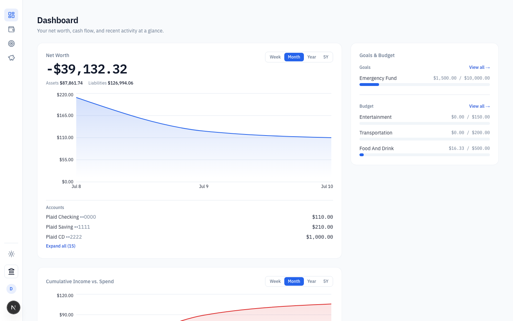
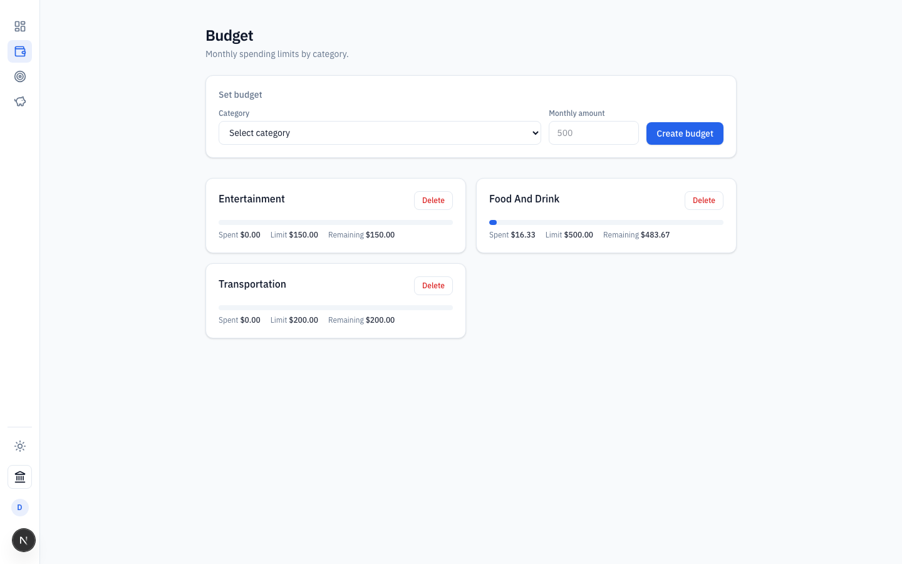
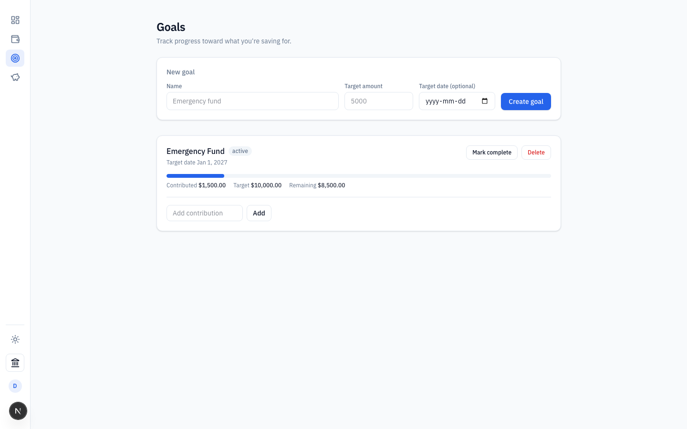
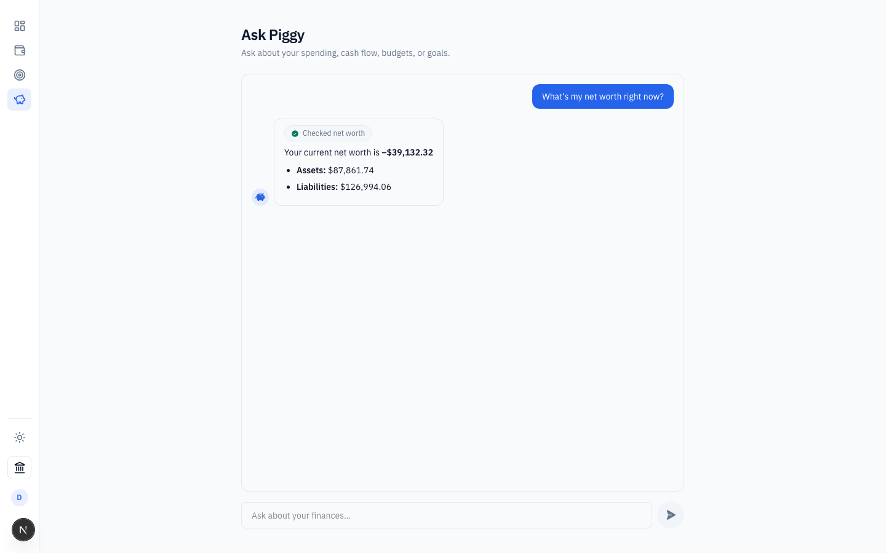

# Personal Finance

An AI-first personal finance app. Users link bank accounts via Plaid, transactions sync automatically, and the app
surfaces net worth, cash flow, budgets, and goals - with an AI assistant ("PiggyAI") that can answer questions and
take action over your financial data.

## Stack

- **Framework:** Next.js (App Router), React 19
- **Auth:** Supabase Auth (Google OAuth + email/password)
- **Database:** Postgres via Prisma (client generated into `generated/prisma`), hosted on Supabase
- **Banking data:** Plaid (`transactionsSync` cursor-based sync)
- **AI:** Vercel AI SDK, Groq by default (`openai/gpt-oss-20b`; provider-registry backed, see `lib/piggyai/model.ts`)
- **Styling/UI:** Tailwind CSS v4, Phosphor/Lucide icons, Recharts

## Features

- **Dashboard** - net worth history and cash flow charts (time-scaled, selectable range), goals/budgets summary
  widget
- **Budgets** - category-based budgets with progress tracking
- **Goals** - savings goals with contribution tracking
- **PiggyAI** - a chat assistant (`/piggyai`) with tool-calling access to the user's financial data
- **Bank linking** - Plaid Link flow to connect accounts, with an initial historical backfill and a daily cron sync

## Screenshots

| Dashboard                                      | Budgets                                    |
| ---------------------------------------------- | ------------------------------------------ |
|  |  |

| Goals                                  | PiggyAI                                    |
| -------------------------------------- | ------------------------------------------ |
|  |  |

## Getting started

1. Copy `.env.example` to `.env` and fill in the values (Plaid, Supabase, database URLs, encryption key, Groq API
   key - see comments in that file for where to get each one).
2. Install dependencies and generate the Prisma client:

    ```bash
    npm install
    npx prisma generate
    ```

3. Apply database migrations:

    ```bash
    npx prisma migrate dev
    ```

4. Run the dev server:

    ```bash
    npm run dev
    ```

Open [http://localhost:3000](http://localhost:3000).

Optionally, seed a local dev account (requires `SUPABASE_SERVICE_ROLE_KEY` in `.env`):

```bash
npm run seed:dev
```

## Commands

```bash
npm run dev            # start dev server
npm run build           # production build
npm run lint            # eslint (flat config, eslint-config-next)
npm run format           # prettier --write .
npm run format:check     # prettier --check .

npx prisma migrate dev --name <name>   # create + apply a migration (uses DIRECT_URL)
npx prisma generate                    # regenerate client into generated/prisma
npx prisma studio                      # inspect the database
```

There is no automated test suite configured in this repo currently.

## Architecture

See [`CLAUDE.md`](./CLAUDE.md) for a detailed architecture writeup (auth model, Plaid sync flow, data-access layer
conventions, App Router structure). Highlights:

- **Auth is Supabase-owned, not Prisma-owned.** `auth.users` is the source of truth; a Postgres trigger mirrors new
  users into the Prisma-managed `public.User` table. `lib/db/user.ts`'s `getCurrentUser()` is the standard entry
  point for "who is calling."
- **Route protection is two layers:** `proxy.ts` (this project's Next.js runs a version where `middleware.ts` is
  renamed `proxy.ts` - see `AGENTS.md`) redirects unauthenticated requests for protected path prefixes, and every
  route/Server Function still calls `getCurrentUser()` itself.
- **RLS is enabled on every table** to lock out Supabase's PostgREST auto-API; Prisma connects as the `postgres`
  role and bypasses RLS, so `getCurrentUser()` + scoping by `userId` is the actual authorization mechanism.
- **Plaid access tokens are encrypted at rest** (AES-256-GCM, `lib/crypto.ts`).
- **Net worth history is a derived time series**, not a live snapshot: `Account.currentBalance` is overwritten on
  every sync, while `AccountBalanceSnapshot` rows (written by the daily cron and backfilled on link) carry the
  history used by the dashboard graph.

## Project structure

```
app/
  (app)/            # authenticated, nav-visible pages: dashboard, budgets, goals, piggyai
  api/               # route handlers (accounts, analytics, budgets, goals, piggyai, plaid, sync, transactions)
  login/ signup/ auth/callback/   # pre-auth pages, outside the app chrome
lib/
  db/                # data-access layer, barrel-exported via lib/db/index.ts
  piggyai/           # PiggyAI system prompt, tools, model registry
  plaid_client.ts, plaid_sync.ts, crypto.ts, prisma_client.ts
  supabase/          # server (cookie-based) and browser Supabase clients
prisma/               # schema + migrations
proxy.ts              # auth gate (Next.js's renamed middleware.ts in this version)
```
